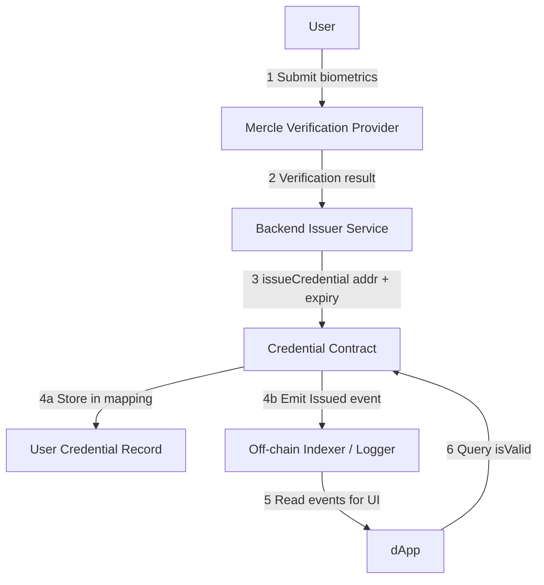
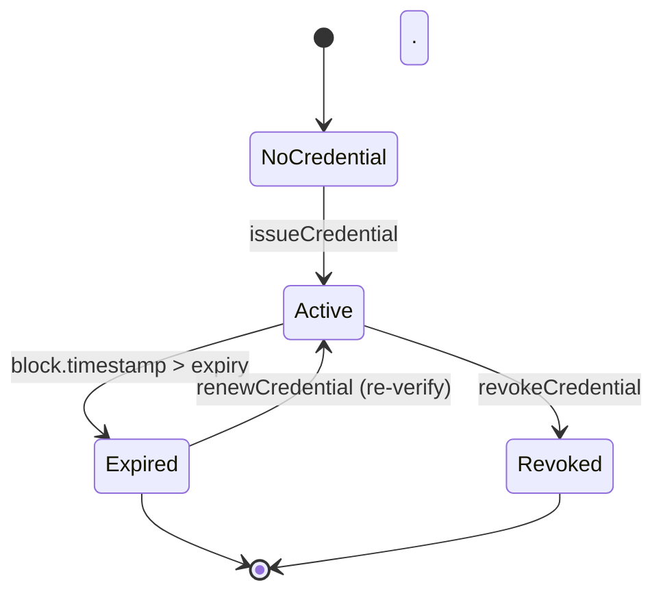

# Smart Contract Credential Storage

## Overview

`CredentialManager` is a smart contract designed to securely issue, manage, and validate **time-bound cryptographic credentials** on-chain. These credentials represent identity verifications performed off-chain (facial verification) and are valid for a fixed period (e.g., 30 days,60 days).

This system is privacy-aware, role-restricted, and optimized for use on EVM-compatible networks such as **Base Sepolia**(currently deployed on).

---

##  Architecture



---

##  Roles

| Role            | Description |
|------------------|-------------|
| `DEFAULT_ADMIN_ROLE` | Can assign/revoke any role. Granted at deployment to the admin address. |
| `ISSUER_ROLE`         | Can issue, renew, and revoke credentials. Typically held by backend services or delegated issuers. |

---

##  Data Model

Each user address maps to a `Credential` struct:

```solidity
struct Credential {
  uint256 expiry;     //  timestamp
  bool active;        // true = valid, false = revoked
  bytes32 dataHash;   //  hash of off-chain metadata 
}
```

Stored in:
```solidity
mapping(address => Credential) private credentials;
```

---

##  Credential Lifecycle



---

##  Functions Summary

| Function | Description |
|----------|-------------|
| `issueCredential(address user, uint256 validityPeriod, bytes32 dataHash)` | Issues a credential valid for `validityPeriod` seconds from now. |
| `renewCredential(address user, uint256 additionalPeriod)` | Extends an active credential by additional time. |
| `revokeCredential(address user)` | Immediately revokes a credential. |
| `isValid(address user)` | Returns true if the credential is active and not expired. |
| `getCredential(address user)` | Returns `(expiry, activeStatus, dataHash)` for the user. |

All mutation functions are protected with:
```solidity
modifier onlyIssuer {
  require(hasRole(ISSUER_ROLE, msg.sender), "Caller is not an authorized issuer");
}
```

---

##  Deployment Guide

### 1. Setup

```bash
npm install --save-dev hardhat dotenv ethers @nomicfoundation/hardhat-toolbox
```

### 2. Hardhat Config (`hardhat.config.js`)

```javascript
require("@nomicfoundation/hardhat-toolbox");
require("dotenv").config();

module.exports = {
  solidity: "0.8.26",
  networks: {
    baseSepolia: {
      url: process.env.RPC_URL,
      accounts: [process.env.PRIVATE_KEY]
    }
  }
};
```

### 3. .env Example

```
PRIVATE_KEY=your_wallet_private_key
RPC_URL=https://sepolia.base.org

```

### 4. Deploy Script (`scripts/deploy.js`)

```javascript
async function main() {
 
  const [deployer] = await ethers.getSigners();
  console.log("Deploying with:", deployer.address);
  const CredentialManager = await ethers.getContractFactory("CredentialManager");
  const admin = deployer.address;  
  const contract = await CredentialManager.deploy(admin);

 
  await contract.deployed();
  console.log("CredentialManager deployed to:", contract.address);
}

main()
  .then(() => process.exit(0))
  .catch(err => {
    console.error(err);
    process.exit(1);
  });

```


## Security Considerations

- **Access Control**: Only authorized issuers can mutate credential states.
- **Replay Protection**: Issuance happens on-chain via signed txs.
- **Expiration**: Enforced using `block.timestamp`.
- **Scalability**: Only minimal data stored (expiry, status, hash).

---

##  Example Usage

```js
await contract.issueCredential(
  userAddress,
  30 * 24 * 60 * 60, // 30 days
  ethers.utils.keccak256("0xhash")
);
```

---


